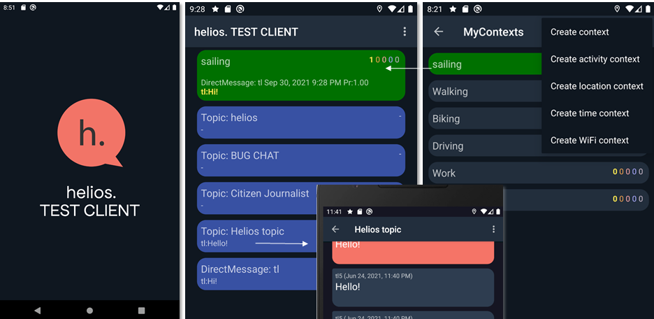

# HELIOS TestClient #

This is a test client Android application utilizing HELIOS Core
modules. The application implements group chat functionality and adds contexts and information 
overflow control on the top of the basic functionality.
It demonstrates the use of different HELIOS Core APIs. The repository
can be built using Android Studio.

  
## HELIOS software repositories and integrating the core modules

The TestClient integrates core modults of HELIOS.

HELIOS software components are organized into different repositories
so that these components can be developed separately avoiding many
conflicts in code integration. However, the modules also depend on
each other.

The  dependences are defined in the `build.gradle` file:
```
dependencies {
    ...
    implementation 'eu.h2020.helios_social.core.storage:storage:1.0.40'
    implementation 'eu.h2020.helios_social.core.messaging:messaging:2.0.13'
    implementation 'eu.h2020.helios_social.core.profile:profile:1.0.9'
    implementation 'eu.h2020.helios_social.core.security:security:1.0.1'
    implementation 'eu.h2020.helios_social.core.context:context:1.0.14'
    implementation 'eu.h2020.helios_social.core.contextualegonetwork:contextualegonetwork:1.0.20'
    implementation 'eu.h2020.helios_social.core.trustmanager:trustmanager:1.0.19'
}
```
To use the dependency in `build.gradle`, you should specify the last version available in Nexus, related to the last Jenkins's deploy.
Thus, the functionality of the above modules can be currently used within the TestClient. New modules can be added by including the dependence to the build.gradle file.

## Building the application using Android Studio ##

Steps to build HELIOS test client Android application:

  * Start Android Studio 4.x IDE
  * Select an option "Open an existing Android Studio project
  * Navigate and select cloned testclient directory
  * Clean the project. Select from menu: *Build=>Clean project*
  * Build the project. Select from menu: *Build=>Rebuild project*
  * Test using emulator. Select from menu: *Run=>Run 'app'*

HELIOS Test Client project referes to other repositories as Android
modules.

## Installing the application to a phone ##

Connect your phone to your computer with the USB cable and allow file
transfer in your phone. Go to testclient directory and give a command:

    $ adb install -r -t ./app/build/outputs/apk/debug/app-debug.apk

The option '-r' should be omitted when installing the first
time. After successful install there should be new application called
"HELIOS Test Client" with HELIOS logo.

## Using the application ##

When the application starts the user should select a nickname in
Settings window. It is also possible to enter other profile, context and
configuration information in the settings. 

TestClient is a multifunctional test application, which
includes group chat and direct peer-to-peer messaging functionality, and adds user-defined 
contexts and information overflow control on the top of the messaging functionality.
It demonstrates the use of different HELIOS Core APIs.

There are chat windows for group chat in topics and direct peer-to-peer messages.  
MyContexts view allows access to the user contexts. The application also aims to recognize the 
contextual importance of incoming messages.



In the above figure, after welcome screen (left image), the TestClient main view (center) is shown (implemented by the 
class `MainActivity` in `eu.h2020.helios_social.heliostestclient.ui`) where on the top 
the currently active user contexts are shown (green color), then, below are topics the user has subscribed. 
The topics provide the area for group discussions. Then, at the bottom, there are entries for 
direct peer-to-peer discussions (the chat views are implemented by the classes `ChatActivity` and 
DirectChatActivity, respectively).  MyContexts view (right) (implemented by `MyContextsView` class) shows 
the user contexts (active ones in green color) and allows the user to create and delete contexts.  
Further, the figure shows the case that a message has arrived that is related to the 
active context ("sailing") of the user. Only messages that are considered contextually important to the user 
are shown/notified here.

## Introduction to integration/development from this example ##

See javadocs in [javadocs.zip](doc/javadocs.zip).

This TestClient integrates together the core modules functionality in order to provide
the HELIOS core functionalities at the moment for the application.

This can be used as a basis to create another HELIOS application. Main starting point would be
`MainActivity.java` in [`eu.h2020.helios_social.heliostestclient.ui`](https://github.com/helios-h2020/h.app-TestClient/tree/master/app/src/main/java/eu/h2020/helios_social/heliostestclient/ui/)
 package. 

It creates the Service for messaging, loads/initializes the user profile and contexts,
and initializes the (peer-to-peer) connectivity.

Please, check the details of individual module libraries `README.md and doc folder for more details.


